# Architecture

This framework separates agentic work into explicit stages. The goal is not to make the model more mystical. The goal is to make the work inspectable.

## Operating Model

1. Intake receives the request, extracts goals, constraints, unknowns, and initial risk.
2. Planning converts the request into reviewable artifacts and checkpoints.
3. Data produces synthetic Python, SQL, or notebook-shaped analysis artifacts inside a tool boundary.
4. Decision turns analysis into an operational risk brief and proposed next actions.
5. Critique tests claims against evidence, constraints, and likely failure modes.
6. Safety pauses actions that affect money, reputation, data, customers, or production systems.
7. Evaluation scores the result so the system can improve over time.

## Public Sub-agent Topology

```text
Intake Agent
  -> Planning Agent
  -> Data Agent
  -> Decision Agent
  -> Critic Agent
  -> Safety Agent
```

This is the public topology, not the full production graph. The point is to show role separation, handoffs, and boundaries without publishing private prompts or routing logic.

```mermaid
flowchart LR
  Request["User request"] --> Intake["Intake Agent"]
  Intake --> Brief["brief"]
  Brief --> Planning["Planning Agent"]
  Planning --> Plan["plan"]
  Plan --> Data["Data Agent"]
  Data --> DataSummary["data_summary"]
  DataSummary --> Decision["Decision Agent"]
  Decision --> RiskBrief["risk_brief"]
  RiskBrief --> Critic["Critic Agent"]
  Critic --> Critique["critique"]
  Critique --> Safety["Safety Agent"]
  Safety --> ApprovalRecord["approval_record"]
  ApprovalRecord --> Evaluation["evaluation"]
```



## Claude Code Primitive Map

| Primitive | Public Role In This Repo | Withheld Boundary |
| --- | --- | --- |
| Sub-agents | Six skeletal role cards in `.claude/agents` | Production prompts and routing heuristics |
| Skills | Two reusable procedures in `.claude/skills` | Private playbooks and full skill library |
| Hooks | Minimal enforcement points in `.claude/hooks` | Production policy engine |
| MCP | Read-only toy context server | Real data connectors and workspace access |
| Settings | Shared project permissions and hook wiring | Personal or enterprise policy |

## Artifacts

Every run carries structured artifacts:

- `brief`: what the user actually asked for.
- `constraints`: deadlines, forbidden moves, style rules, budgets, privacy boundaries.
- `plan`: proposed steps and required checkpoints.
- `data_summary`: synthetic analysis facts and evidence.
- `risk_brief`: operational risk judgment and proposed next actions.
- `critique`: failures, weak assumptions, and missing verification.
- `approval_record`: what needed a human decision and what the decision was.
- `evaluation`: rubric scores and notes.

## Context Strategy

The framework distinguishes between four kinds of context:

- Project context: durable facts about the system or business.
- Task context: facts needed for the current run.
- Tool context: what the agent can actually inspect or change.
- Decision context: why a choice was made.

The agent can be creative in the work. It cannot be creative about the rules of engagement.

## Failure Modes Addressed

- Misread requests.
- Hidden assumptions.
- Tool overreach.
- Unreviewed irreversible actions.
- Unsupported operational recommendations.
- One-shot prompting that cannot explain itself.
- Work that cannot be evaluated after the fact.
